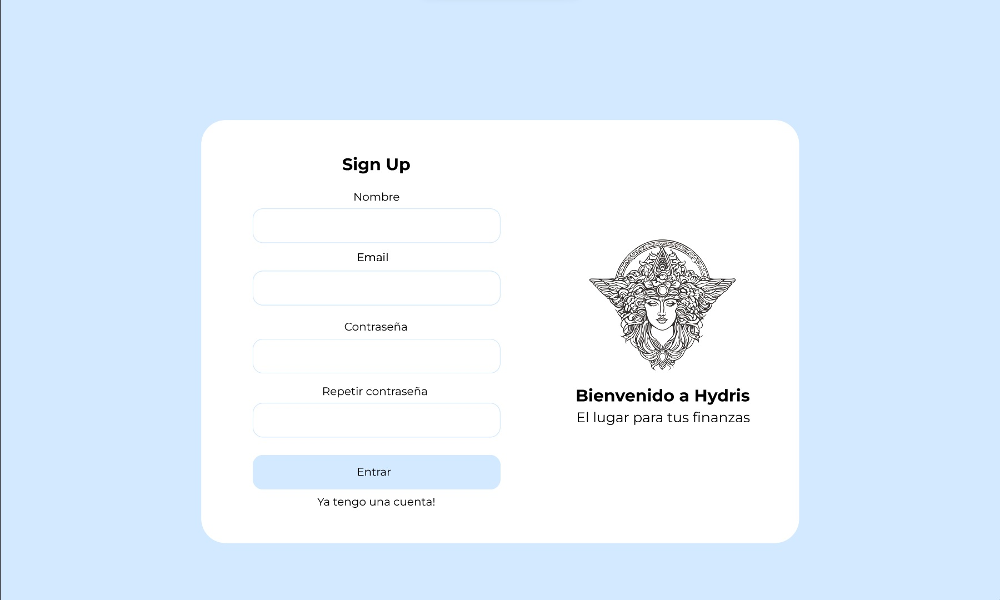
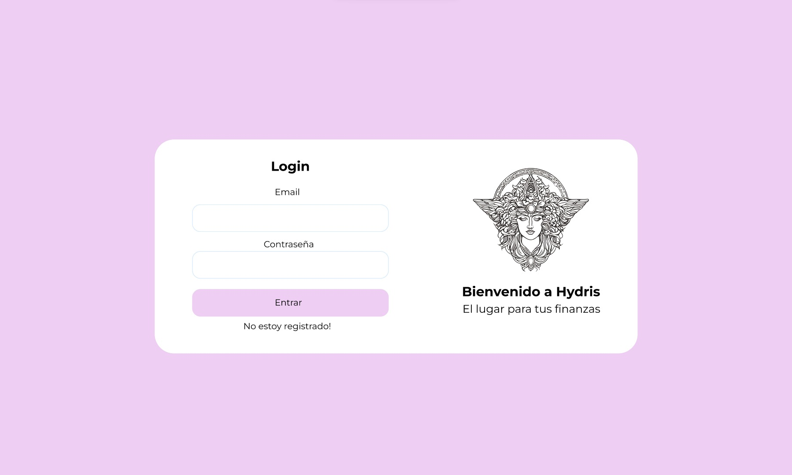
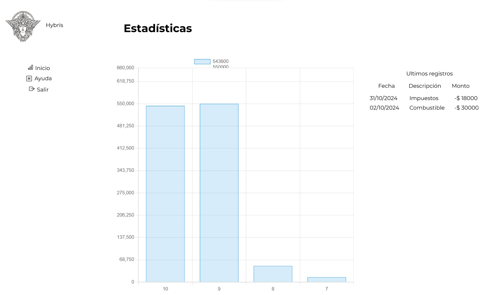
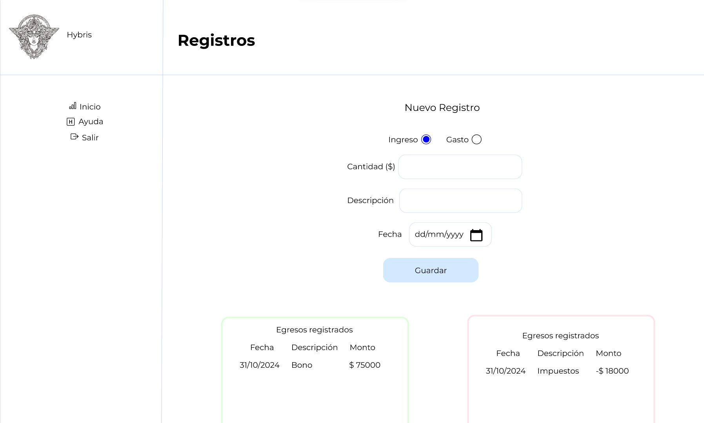

<h1>Expense Tracker</h1>

Hi all, I've been working on this project for college and it was actually fun to do.

We are seeing an expense tracker made from mainly HTML, CSS and PHP, it is connected to a 
database so your login and sign up are completely functional and your expenses/incomes can 
only be made by you. I learned the basics of php and I already knew html, css and js.

<figcaption>Sign Up page</figcaption>
 

<figcaption>Login page</figcaption>
 

<figcaption>Index page</figcaption>
 

<figcaption>Registers page</figcaption>

If you want to make use of this code go ahead but remember to change your db.php settings for your own project

